Deskripsi

Sistem Manajemen Rumah Sakit adalah aplikasi berbasis web yang dirancang untuk mendukung digitalisasi layanan dan manajemen data di rumah sakit. Sistem ini mengelola informasi penting mulai dari data pasien, dokter, staff, jadwal rawat jalan/rawat inap, resep obat, billing/pembayaran dan masih banyak lagi.

Fitur Utama

    Manajemen Pengguna: Admin, Dokter, dan Resepsionis dengan hak akses berbeda.

    Manajemen Pasien: Pendaftaran pasien baru, pencatatan data, dan riwayat kunjungan.

    Jadwal Janji Temu: Booking, pencatatan, dan update jadwal pemeriksaan pasien dengan dokter.

    Rawat Inap & Rawat Jalan: Pengelolaan ruangan, laporan perawatan hingga discharge.

    Rekam Medis Elektronik: Penyimpanan dan pencarian catatan medis pasien.

    Manajemen Obat: Data obat dan resep dari dokter, serta laporan penggunaan obat.

    Billing & Tagihan: Pencatatan transaksi, pembayaran, laporan keuangan.

    Manajemen Staff & Dokter: Data pegawai, jadwal kerja, dan spesialisasi dokter.

    Keamanan Data: Password terenkripsi (bcrypt), proteksi SQL Injection, cookie HttpOnly dan session management.

Tampilan dari Website

Register

  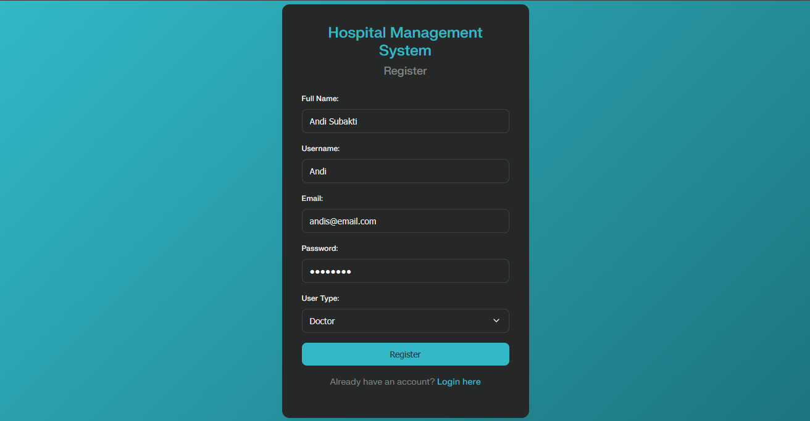

Login

  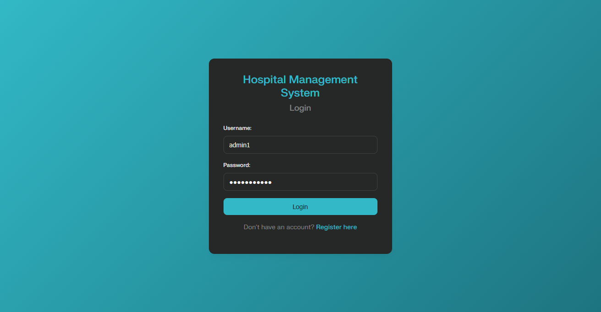

Dashboard Admin

  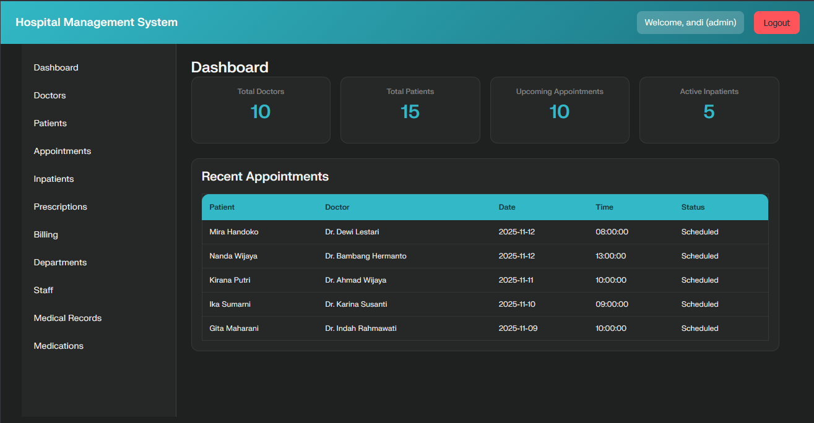

Tab Dokter

  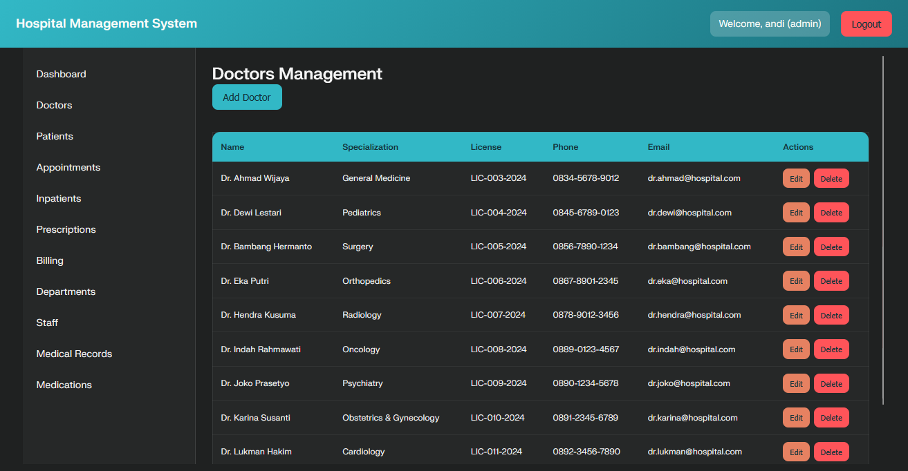

Tab Pasien

  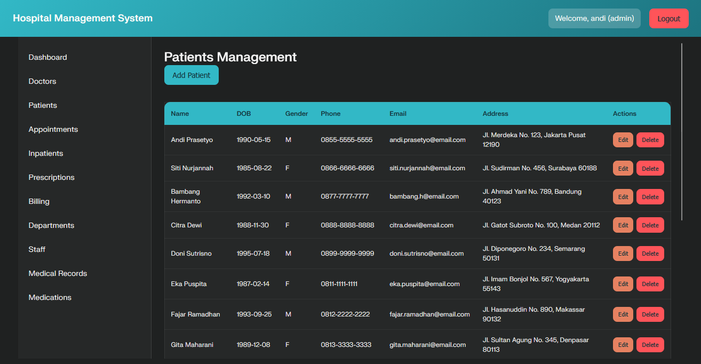

Tab Jadwal Checkup

  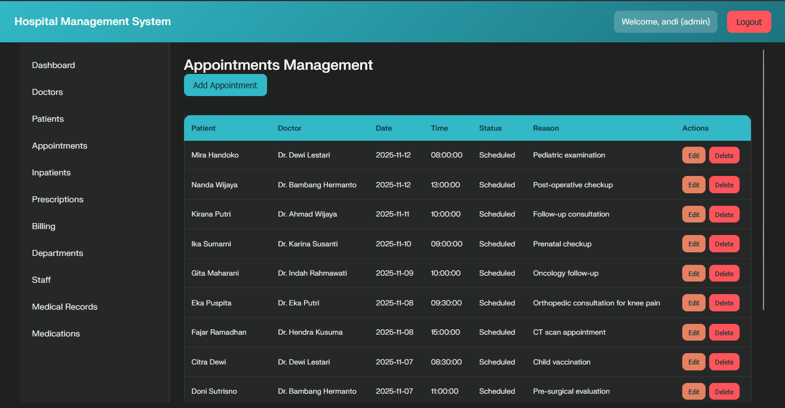

Tab Pasien Rawat Inap

  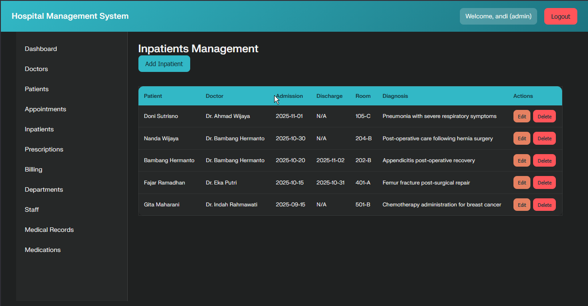

Tab Resep Obat

  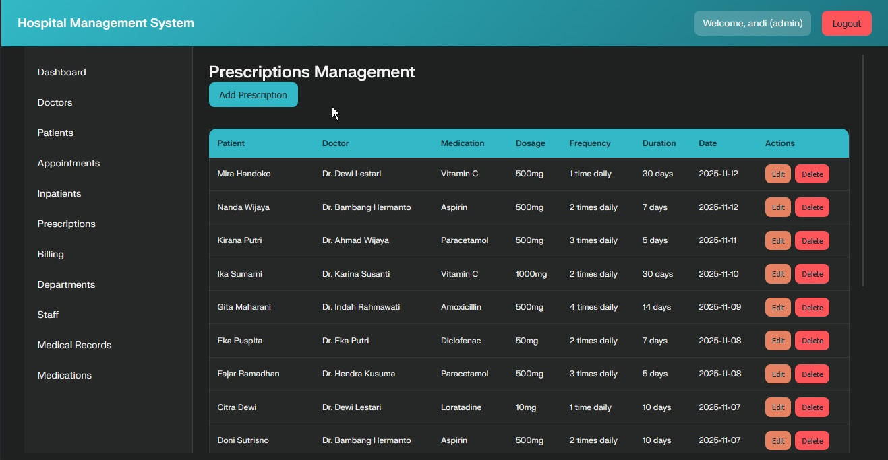

Tab Tagihan

  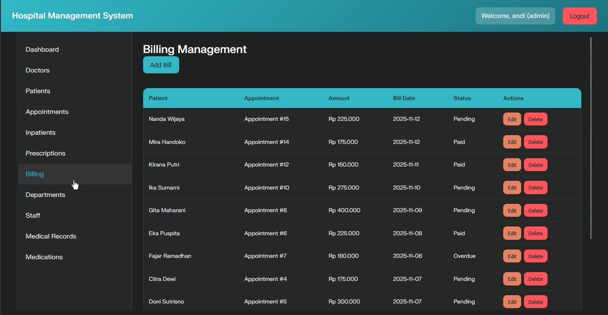

Tab Departemen

  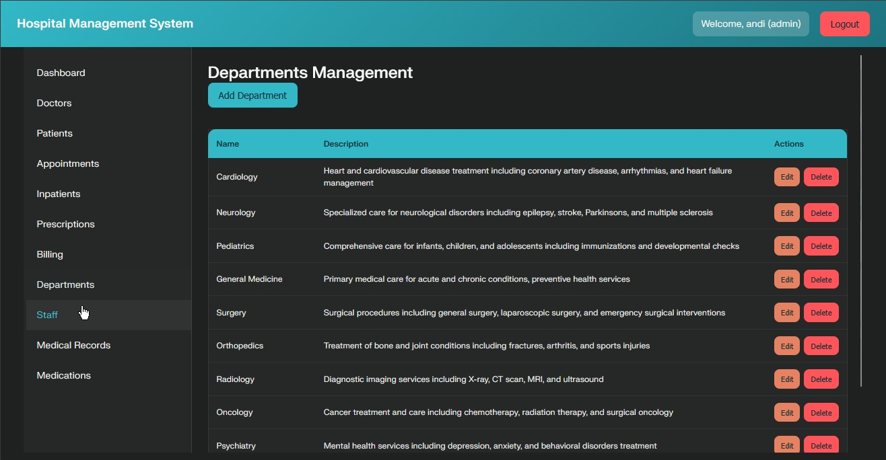

Tab Staf

  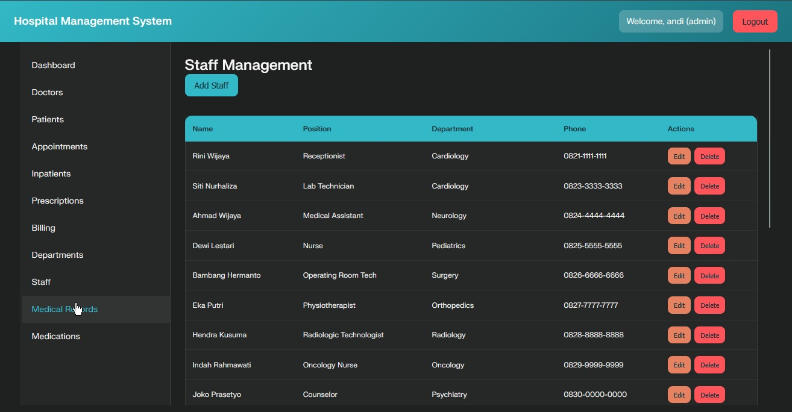

Tab Obat-obatan

  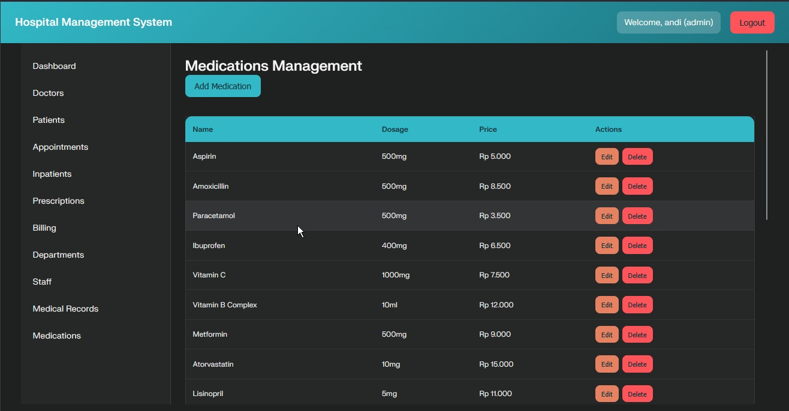

